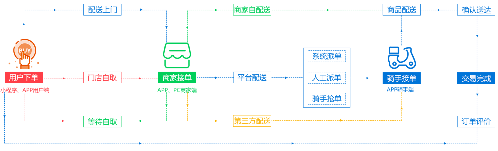
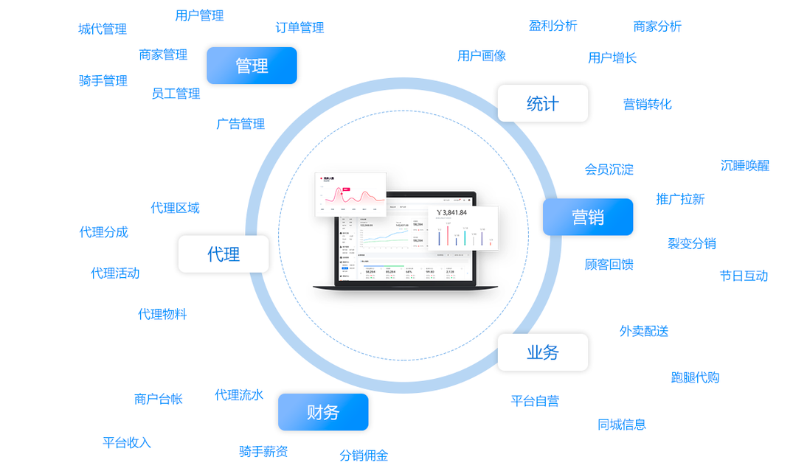
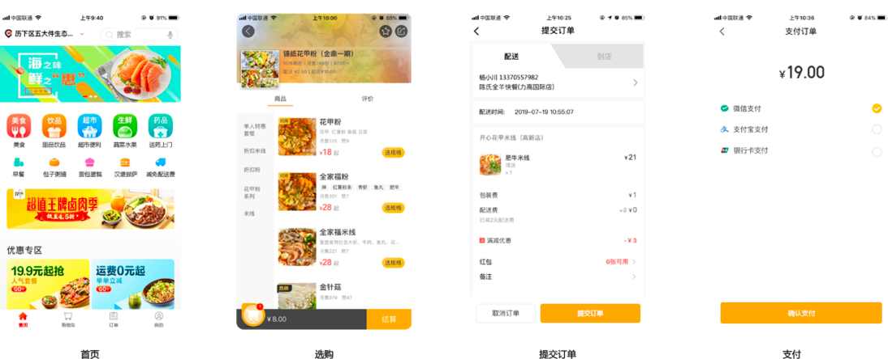
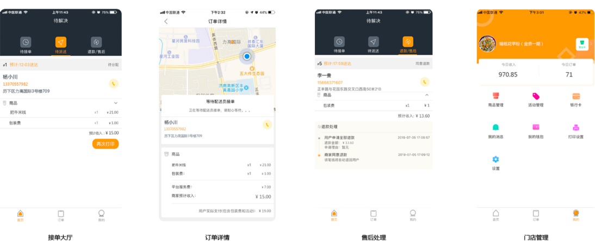
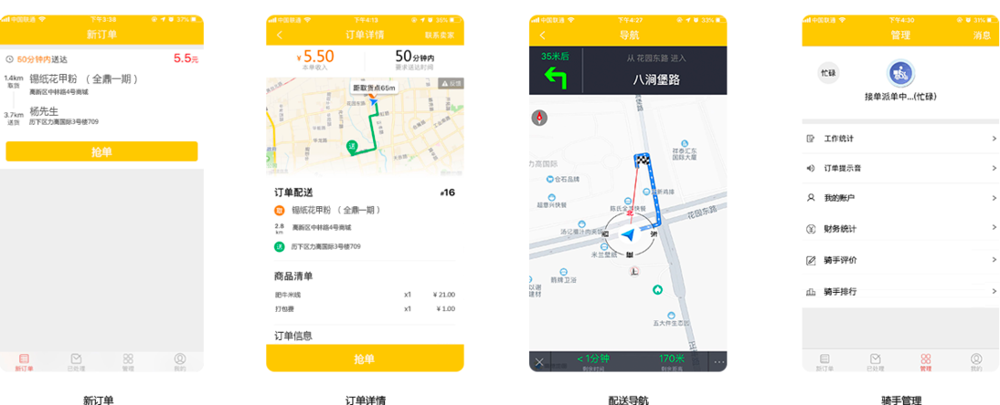
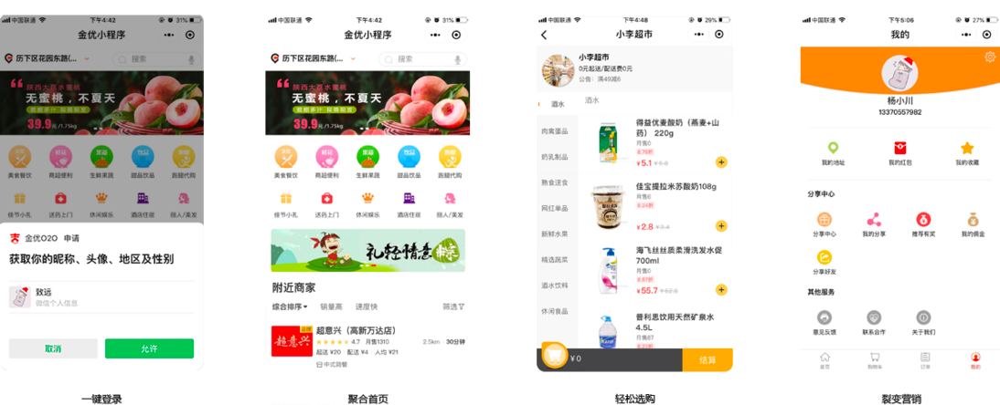
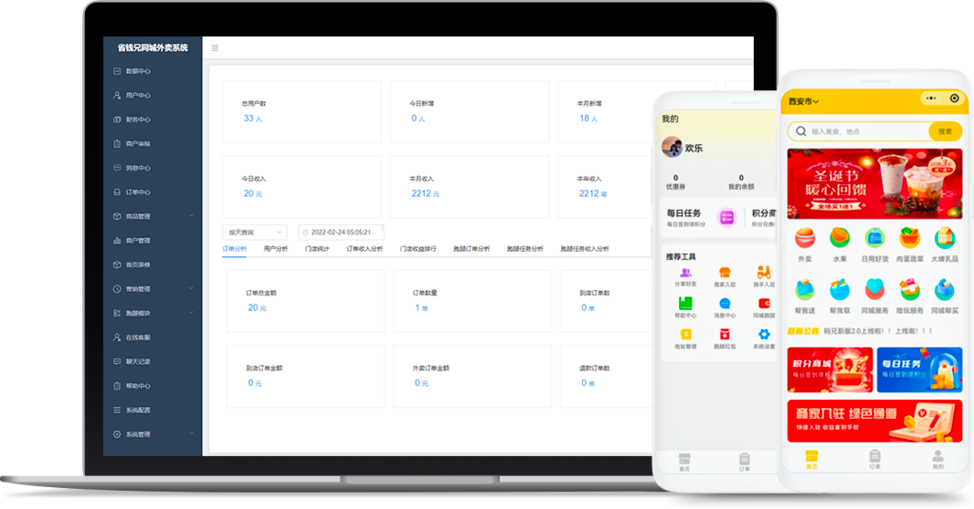

# 外卖产品介绍

## 源码开发

源码可整套销售全开源 不加密

## 原创团队

该源码为本公司自主编写技术领先稳定靠谱

## 技术团队使用

该源码不加密可二开适合技术团队用于客户定制

# 外卖业务流程图

打通外卖业务全流程，让平台业务处理更高效！

## 功能强大的管理后台

高效、易用、功能强大的JAVA后台，才是外卖创业者的首选！

# 同城外卖平台核心功能

## 用户端

## 商家

## 骑手

## 小程序/APP

## 管理后台

# 方案优势

## 支持OEM定制部署
平台管理后台、商家及配送端、APP小程序、公众号等页面，只会出现你自己的品牌LOGO与版权信息

## 飞鹅智能云打印机完美支持

汇匠源外卖o2o与飞鹅打印机的合作，进一步加强了软件与硬件打印的结合，通过简短的几分钟操作即可完成打印机与金优外卖的绑定，实现智能云打印服务，无需另外配备电脑、手机，也无需人工监管打印，打印机在接收到订单后便会自动打印出单。  除支持飞鹅打印机外，金优外卖系统支持所有主流品牌打印机。

## 系统不断更新

同城外卖市场的变化日新月异，每 周更新小版本，升级永无止境

## 专业的技术团队支撑

20+从事外卖返利领域技术开发的工程师 为客户提供强有力的技术支撑和保障

## 成熟的同城外卖应用体系

领先行业的开发理念和思路， 时刻领跑行业风向标

## 可提供程序源代码

将代码放在自己的服务器，数据 可控可二次开发

## 快速部署投入运营

专业的SaaS架构平台帮助用户快速 部署产品，以最快的速度上线运营

## 一对一的售后服务体系

以用户的需求为第一考量标准，让每 一位用户都能切身感受到售后的支持

# 合作案例

1. 普洱市康讯外卖
2. 遵义市达达外卖
3. 浪食智慧智慧中央厨房
4. 缅甸牛仔外卖

# 服务方式

1. 保证代码无任何加密。
2. 提供标准化产品上架资料申请和上架。
3. 所有B端运营资料提供、免费提供优质硬件供应商价格。
4. 可帮助搭建敏捷开发流程团队管理软件搭建及培训。
5. 售后30天、24小时客服。

# 联系我们

官网：[www.hjy-yn.com](http://www.hjy-yn.com)

公众号：云匠智能

电话：17606964366
